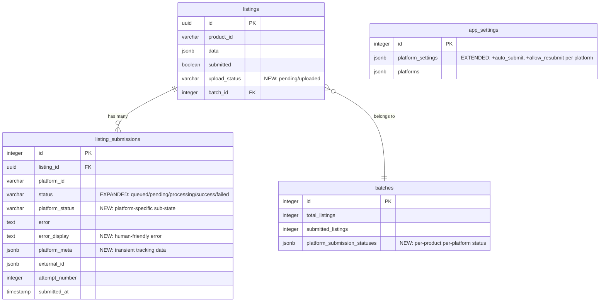

# Upload Status & Per-Platform Submission Lifecycle

## Enhancement Summary

**Deepened on:** 2026-03-19
**Agents used:** 12 (security-sentinel, architecture-strategist, data-integrity-guardian, data-migration-expert, deployment-verification-agent, schema-drift-detector, julik-frontend-races-reviewer, kieran-python-reviewer, performance-oracle, pattern-recognition-specialist, code-simplicity-reviewer, framework-docs-researcher)

### Critical Bugs Found & Fixed

1. **Poller shutdown blocks for full interval** — `asyncio.sleep()` replaced with `wait_for(shutdown_event.wait(), timeout=interval)` pattern from existing sellercloud_service.py
2. **`select_for_update()` with JOIN locks parent `listings` rows** — split into two-step query: first find eligible listing IDs, then lock only submission rows
3. **Missing `in_transaction()` around all `select_for_update()` calls** — without explicit transaction, locks release immediately (useless)
4. **SPO batch upload atomicity gap** — separate "claim rows" transaction from "slow network I/O" to avoid holding locks during HTTP calls
5. **First-submission race condition** — when no prior submission exists, `SELECT FOR UPDATE` returns empty set. Fix: lock the `listings` row (always exists) or add partial unique index
6. **Frontend stale poll overwrites fresh submission** — poll response from previous cycle stomps optimistic status. Fix: epoch/sequence guard on poll responses

### Migration Safety Fixes

7. **external_id VARCHAR→JSONB cast** — added defensive regex-based fallback for non-JSON strings: `WHEN text ~ '^\s*[\[{"]' THEN ::jsonb ELSE to_jsonb(text)`
8. **Missing `DROP CONSTRAINT IF EXISTS chk_listings_upload_status`** — breaks idempotency
9. **Batch trigger missing NULL guard for `v_product_id`** — crashes if any listing lacks product_id
10. **Trigger redundant re-query** — use `NEW.status` directly instead of re-querying listing_submissions
11. **Missing backfill for existing batches** — `platform_submission_statuses` JSONB will be empty for historical data
12. **Rollback SQL** — full DOWN migration documented

### Key Pattern Corrections

13. **Extract `BasePoller` ABC** — shared shutdown/lifecycle behavior prevents divergent implementations
14. **Add `SubmissionStatus` StrEnum** — centralizes 5 status values used across 6+ files
15. **Use recursive `setTimeout` not `setInterval`** — prevents overlapping poll timers during interval changes
16. **Add `submitInFlightRef` guard** — prevents double-click race on Submit button (React state is async)
17. **Run XLSX generation in `run_in_executor`** — CPU-bound openpyxl blocks event loop
18. **Add `max_auto_submit_per_cycle` LIMIT** — prevents thundering herd on large imports
19. **Sanitize P44/OF03 Excel data** — stored XSS risk via `error_display`
20. **Add partial unique index for in-flight guard** — `WHERE status IN ('queued','pending','processing')` as DB-level safety net

### Simplification Considerations (User Decision Required)

The code simplicity reviewer identified potential over-engineering. These are features the user explicitly requested during brainstorming, so they are preserved but flagged:
- `platform_meta` column could reuse `external_id` JSONB instead
- Batch trigger could be replaced with on-read query (eliminates 56 lines PL/pgSQL)
- `platform_status` column could be tracked in `external_id` JSONB instead
- Adaptive polling could be simplified to fixed interval

### Supporting Artifacts

- **Deployment checklist:** `docs/checklists/2026-03-19-deployment-checklist-upload-status-submission-lifecycle.md` — 18 pre-deployment verification queries, staged poller rollout, rollback procedures

---

## Overview

Add proper submission lifecycle management for listings across multiple platforms. Listings track image upload readiness (`upload_status`), each platform submission follows a stateful lifecycle (`queued -> pending -> processing -> success/failed`), and a new SPO (ShopSimon/Mirakl) platform is integrated with async batch imports. Background pollers handle auto-submission and SPO status tracking. The UI shows per-platform status on platform avatars in the listing detail view.

This plan carries forward all 33 decisions from the brainstorm (see brainstorm: `docs/brainstorms/2026-03-18-upload-status-platform-submissions-brainstorm.md`).

## Problem Statement

**Current pain points:**
- No concept of "images not ready yet" — listings can be submitted before images are uploaded
- Submissions are instant fire-and-forget; no tracking for platforms that take time (SPO can take hours/days)
- Grailed has a 31% failure rate with no clear error display to users
- `submitted_at` on `listing_submissions` is never populated
- No way to prevent premature submissions or auto-queue when ready
- No SPO platform integration exists

## Proposed Solution

Extend the existing schema and submission flow rather than replace it (see brainstorm: Approach A). Seven interconnected changes:

1. **`upload_status` on listings** — `pending` (images uploading) / `uploaded` (images ready)
2. **Expanded submission statuses** — `queued`, `pending`, `processing`, `success`, `failed`
3. **`platform_status` column** — granular sub-steps for async platforms (SPO)
4. **`error_display` column** — human-friendly error messages
5. **`platform_meta` column** — transient tracking data (SPO import IDs)
6. **Background pollers** — submission poller (queued->pending + auto-submit) and SPO poller (P42/OF02 tracking)
7. **SPO service** — Mirakl P41/P42/OF01/OF02 integration with batch imports

## Technical Approach

### Architecture

```
                    ┌─────────────────────────────────────────┐
                    │            FastAPI App (app.py)          │
                    │                                         │
                    │  startup:                               │
                    │    ├── sellercloud_service.initialize()  │
                    │    ├── submission_poller.start()   NEW   │
                    │    └── spo_poller.start()          NEW   │
                    │                                         │
                    │  POST /listings/submit                  │
                    │    ├── submission guard (with locking)   │
                    │    ├── create listing_submissions rows   │
                    │    └── fire background task              │
                    │                                         │
                    │  Background Tasks:                      │
                    │    ├── submission_poller (60s interval)  │
                    │    │   ├── queued -> pending transitions │
                    │    │   └── auto-submit for configured   │
                    │    │       platforms                     │
                    │    └── spo_poller (30s interval)         │
                    │        ├── batch pending -> P41 upload   │
                    │        ├── P42 status tracking           │
                    │        ├── P44 error report parsing      │
                    │        ├── OF01 offer upload             │
                    │        └── OF02 status tracking          │
                    └─────────────────────────────────────────┘
                                       │
                    ┌──────────────────┴──────────────────┐
                    │         listing_submissions          │
                    │                                      │
                    │  status lifecycle:                    │
                    │  queued ──► pending ──► processing    │
                    │                        ──► success    │
                    │                        ──► failed     │
                    │                                      │
                    │  new columns:                         │
                    │  + error_display   (human-friendly)   │
                    │  + platform_status (sub-steps)        │
                    │  + platform_meta   (tracking data)    │
                    └──────────────────────────────────────┘
```

### ERD — Schema Changes



### Implementation Phases

---

#### Phase 1: Database Schema & Migration

**Goal:** All schema changes applied, existing data migrated safely, DB triggers updated.

**Files to create/modify:**

- `API/migrations/add_upload_status_and_submission_lifecycle.sql` (NEW)
- `API/models/db_models.py` (MODIFY)
- `API/models/api_models.py` (MODIFY)
- `API/database_setup.sql` (MODIFY)

##### 1.1 Migration SQL

```sql
-- Migration: add_upload_status_and_submission_lifecycle
-- Description: Adds upload_status to listings, expands listing_submissions with
--              error_display/platform_status/platform_meta, adds batch platform statuses
-- Date: 2026-03-19

BEGIN;

-- === LISTINGS TABLE ===
ALTER TABLE listings ADD COLUMN IF NOT EXISTS upload_status VARCHAR(20) NOT NULL DEFAULT 'pending';

-- Migrate existing listings (all have images already uploaded)
UPDATE listings SET upload_status = 'uploaded';

-- Constrain to valid values
ALTER TABLE listings ADD CONSTRAINT chk_listings_upload_status
    CHECK (upload_status IN ('pending', 'uploaded'));

-- Index for poller queries
CREATE INDEX IF NOT EXISTS idx_listings_upload_status ON listings (upload_status);

-- === LISTING_SUBMISSIONS TABLE ===
ALTER TABLE listing_submissions ADD COLUMN IF NOT EXISTS error_display TEXT;
ALTER TABLE listing_submissions ADD COLUMN IF NOT EXISTS platform_status VARCHAR(50);
ALTER TABLE listing_submissions ADD COLUMN IF NOT EXISTS platform_meta JSONB;

-- Constrain status to valid values
ALTER TABLE listing_submissions DROP CONSTRAINT IF EXISTS chk_listing_submissions_status;
ALTER TABLE listing_submissions ADD CONSTRAINT chk_listing_submissions_status
    CHECK (status IN ('queued', 'pending', 'processing', 'success', 'failed'));

-- Fix external_id column type (ORM expects JSONB, migration created VARCHAR)
ALTER TABLE listing_submissions ALTER COLUMN external_id TYPE JSONB
    USING CASE WHEN external_id IS NULL THEN NULL ELSE external_id::jsonb END;

-- Index for poller queries
CREATE INDEX IF NOT EXISTS idx_listing_submissions_status_platform
    ON listing_submissions (status, platform_id);

-- === BATCHES TABLE ===
ALTER TABLE batches ADD COLUMN IF NOT EXISTS platform_submission_statuses JSONB DEFAULT '{}';

-- === UPDATE submitted_at TRIGGER ===
-- Current trigger only handles pending -> success/failed.
-- Update to handle processing -> success/failed as well.
CREATE OR REPLACE FUNCTION set_submitted_at_on_completion()
RETURNS TRIGGER AS $$
BEGIN
    -- Set submitted_at when reaching terminal state from any non-terminal state
    IF OLD.status IN ('pending', 'processing', 'queued')
       AND NEW.status IN ('success', 'failed') THEN
        NEW.submitted_at := CURRENT_TIMESTAMP;
    END IF;
    NEW.updated_at := CURRENT_TIMESTAMP;
    RETURN NEW;
END;
$$ LANGUAGE plpgsql;

-- === NEW: Batch platform submission statuses trigger ===
CREATE OR REPLACE FUNCTION update_batch_platform_statuses()
RETURNS TRIGGER AS $$
DECLARE
    v_batch_id INTEGER;
    v_product_id VARCHAR;
    v_listing_id UUID;
    v_platform_id VARCHAR;
    v_latest_status VARCHAR;
BEGIN
    -- Get the listing_id from the submission record
    v_listing_id := COALESCE(NEW.listing_id, OLD.listing_id);
    v_platform_id := COALESCE(NEW.platform_id, OLD.platform_id);

    IF v_listing_id IS NULL THEN
        RETURN NEW;
    END IF;

    -- Look up batch_id and product_id from listings
    SELECT batch_id, product_id INTO v_batch_id, v_product_id
    FROM listings WHERE id = v_listing_id;

    -- Skip if listing has no batch
    IF v_batch_id IS NULL THEN
        RETURN NEW;
    END IF;

    -- Get the latest status for this listing+platform (highest attempt_number)
    SELECT ls.status INTO v_latest_status
    FROM listing_submissions ls
    WHERE ls.listing_id = v_listing_id
      AND ls.platform_id = v_platform_id
    ORDER BY ls.attempt_number DESC
    LIMIT 1;

    -- Update the JSONB: {product_id: {platform_id: latest_status}}
    UPDATE batches
    SET platform_submission_statuses = jsonb_set(
        jsonb_set(
            platform_submission_statuses,
            ARRAY[v_product_id],
            COALESCE(platform_submission_statuses -> v_product_id, '{}'::jsonb)
        ),
        ARRAY[v_product_id, v_platform_id],
        to_jsonb(v_latest_status)
    ),
    updated_at = CURRENT_TIMESTAMP
    WHERE id = v_batch_id;

    RETURN NEW;
END;
$$ LANGUAGE plpgsql;

DROP TRIGGER IF EXISTS trigger_update_batch_platform_statuses ON listing_submissions;
CREATE TRIGGER trigger_update_batch_platform_statuses
    AFTER INSERT OR UPDATE OF status ON listing_submissions
    FOR EACH ROW
    EXECUTE FUNCTION update_batch_platform_statuses();

COMMIT;
```

##### 1.2 Tortoise ORM Model Updates

**`API/models/db_models.py`**

`Listing` model — add:
```python
upload_status = fields.CharField(max_length=20, default="pending")
```

`ListingSubmission` model — add:
```python
error_display = fields.TextField(null=True)
platform_status = fields.CharField(max_length=50, null=True)
platform_meta = fields.JSONField(null=True)
```

`Batch` model — add:
```python
platform_submission_statuses = fields.JSONField(default=dict)
```

##### 1.3 Pydantic API Model Updates

**`API/models/api_models.py`**

Update `ListingSubmissionResponse`:
```python
status: Literal["queued", "pending", "processing", "success", "failed"]
error_display: Optional[str] = None
platform_status: Optional[str] = None
```

Update `ListingResponse` to include `upload_status`:
```python
upload_status: str = "pending"
```

##### 1.4 Acceptance Criteria — Phase 1

- [ ] Migration runs idempotently on both test (`lux_listing_test`) and prod (`lux_listing`) databases
- [ ] All 973 existing listings have `upload_status = 'uploaded'` after migration
- [ ] CHECK constraints exist on `listings.upload_status` and `listing_submissions.status`
- [ ] `external_id` column is JSONB type (migrated from VARCHAR)
- [ ] `submitted_at` trigger fires on `processing -> success/failed` transitions
- [ ] Batch trigger updates `platform_submission_statuses` on submission INSERT/UPDATE
- [ ] Batch trigger skips listings with no batch (`batch_id IS NULL`)
- [ ] ORM models match DB schema

##### 1.5 Research Insights — Phase 1

**Migration Safety (from data-migration-expert, data-integrity-guardian):**

- **MUST FIX:** The `external_id` VARCHAR→JSONB cast will fail on non-JSON strings. Use a defensive cast:
  ```sql
  ALTER TABLE listing_submissions ALTER COLUMN external_id TYPE JSONB
      USING CASE
          WHEN external_id IS NULL THEN NULL
          WHEN external_id = '' THEN NULL
          WHEN external_id::text ~ '^\s*[\[{"]' THEN external_id::jsonb
          ELSE to_jsonb(external_id)
      END;
  ```
  Wrap in a conditional `DO $$ ... END $$` block so re-running is a no-op if already JSONB.

- **MUST FIX:** Add `ALTER TABLE listings DROP CONSTRAINT IF EXISTS chk_listings_upload_status;` before the `ADD CONSTRAINT` for idempotency.

- **MUST FIX:** Add NULL guard for `v_product_id` in batch trigger:
  ```sql
  IF v_batch_id IS NULL OR v_product_id IS NULL THEN
      RETURN NEW;
  END IF;
  ```

- **SHOULD FIX:** Trigger re-queries `listing_submissions` to get latest status but it already has `NEW.status`. Replace the subquery with `v_latest_status := NEW.status;` — eliminates 1 query per trigger fire.

- **SHOULD FIX:** Add backfill for existing batches after trigger creation (otherwise historical batch data shows empty platform statuses).

- **SHOULD FIX:** Add pre-migration validation queries:
  ```sql
  -- Verify all external_id values are castable to JSONB
  SELECT id, external_id FROM listing_submissions
  WHERE external_id IS NOT NULL AND external_id !~ '^\s*[\[{"]';
  -- Verify all status values pass CHECK constraint
  SELECT status, COUNT(*) FROM listing_submissions GROUP BY status;
  ```

- **SHOULD FIX:** Provide rollback SQL (documented in deployment checklist).

- **Add partial unique index** as DB-level safety net against duplicate in-flight submissions:
  ```sql
  CREATE UNIQUE INDEX idx_listing_submissions_inflight
      ON listing_submissions (listing_id, platform_id)
      WHERE status IN ('queued', 'pending', 'processing');
  ```

- **Drop redundant single-column indexes** after adding composite `(status, platform_id)`:
  ```sql
  DROP INDEX IF EXISTS idx_listing_submissions_platform_id;
  DROP INDEX IF EXISTS idx_listing_submissions_status;
  ```

**Schema Drift (from schema-drift-detector):**
- Confirmed: `external_id` VARCHAR(255) in DB vs JSONField in ORM — plan's migration resolves this
- Found: `listing_id` FK is NOT NULL + CASCADE in original migration but `null=True, SET_NULL` in ORM. The ORM and DB agree now (both nullable) but original intent differs. Document this as intentional.
- Found: `app_settings.app_variables` is `json` in DB but ORM uses `jsonb`. Low priority, not addressed by this plan.
- Found: Orphaned `product_description_template` and `product_name_template` columns in `app_settings` — not in ORM. Consider cleanup in a separate migration.

**Pydantic Types (from kieran-python-reviewer):**
- Use `Literal["pending", "uploaded"]` for `upload_status` on `ListingResponse`, not bare `str`
- Use `str | None` instead of `Optional[str]` for new fields (modern Python syntax)

**Pattern (from pattern-recognition-specialist):**
- Add `SubmissionStatus` StrEnum as single source of truth for status values:
  ```python
  from enum import StrEnum
  class SubmissionStatus(StrEnum):
      QUEUED = "queued"
      PENDING = "pending"
      PROCESSING = "processing"
      SUCCESS = "success"
      FAILED = "failed"
  ```
- Update `Listing.get_submission_summary()` in `db_models.py` to count `queued` and `processing` alongside `pending`

---

#### Phase 2: Submission Guard & Flow Updates

**Goal:** The existing submit endpoint respects `upload_status`, creates `queued`/`pending` rows correctly, guards against races with DB locking, and the UI shows new statuses.

**Files to modify:**

- `API/routes/listing_routes.py`
- `API/routes/settings_routes.py`
- `API/services/listing_service.py`

##### 2.1 Submission Guard with Locking

Update `POST /listings/submit` in `listing_routes.py`:

```python
# Inside a transaction with row-level locking:
# 1. SELECT latest submission for each (listing_id, platform_id) FOR UPDATE
# 2. Check in-flight: reject if latest status IN ('queued', 'pending', 'processing')
# 3. Check resubmit: reject if latest status = 'success' AND allow_resubmit = false
# 4. Determine initial status:
#    - 'queued' if listing.upload_status = 'pending'
#    - 'pending' if listing.upload_status = 'uploaded'
# 5. Create new row with attempt_number = MAX + 1
```

Key: wrap guard + row creation in `async with in_transaction()` using `select_for_update()` on the latest submission to prevent races between concurrent requests and the background poller.

##### 2.2 Platform Settings Extension

Add `auto_submit` and `allow_resubmit` flags to `platform_settings` JSONB via settings routes. Update `GET/PUT /settings/platform_settings` to handle new fields.

Default values when flags are missing:
```python
auto_submit = platform_settings.get(platform_id, {}).get("auto_submit", False)
allow_resubmit = platform_settings.get(platform_id, {}).get("allow_resubmit", True)
```

##### 2.3 Submission Status Endpoint Update

Update `GET /listings/submission_status` to return:
- `error_display` — human-friendly error message
- `platform_status` — sub-step for `processing` submissions
- Keep existing `status`, `error`, `external_id` fields

##### 2.4 Background Task Changes

Update `_run_submissions_background()`:
- Skip `queued` submissions (they wait for the poller)
- For `pending` submissions, proceed as before
- Set `status = 'processing'` for platforms that are async (SPO)
- Populate `error_display` on failure (platform services set this)

##### 2.5 Stale Submission Recovery

Add a check in the submission poller (or as part of startup):
- Find submissions in `pending` status for > 10 minutes with no active processing
- Mark as `failed` with `error_display = "Submission timed out — please retry"`
- This prevents permanently stuck submissions after process crashes (see SpecFlow Gap 3)

##### 2.6 Acceptance Criteria — Phase 2

- [ ] Submitting with `upload_status = 'pending'` creates `queued` rows, not `pending`
- [ ] Submitting with `upload_status = 'uploaded'` creates `pending` rows and fires platform tasks
- [ ] Concurrent submissions to same listing+platform are blocked by DB lock (no duplicates)
- [ ] `allow_resubmit = false` blocks resubmission after success
- [ ] In-flight guard blocks when latest status is `queued`, `pending`, or `processing`
- [ ] `/submission_status` returns `error_display` and `platform_status`
- [ ] Stale `pending` submissions (>10min) are auto-failed on poller startup

##### 2.7 Research Insights — Phase 2

**Submission Guard Locking (from architecture-strategist, performance-oracle, security-sentinel):**

- **CRITICAL:** When no prior submission exists for a listing+platform, `SELECT FOR UPDATE` returns empty set — no lock acquired. Fix: **lock the `listings` row instead** (always exists):
  ```python
  async with in_transaction("default") as conn:
      # Lock listing row to serialize concurrent submissions
      listing = await Listing.select_for_update().using_db(conn).get(id=listing_id)
      for platform_id in platforms:
          latest = await ListingSubmission.filter(
              listing=listing, platform_id=platform_id
          ).using_db(conn).order_by("-attempt_number").first()
          # ... guard checks ...
          await ListingSubmission.create(..., using_db=conn)
  ```
  The entire multi-platform guard+create loop must be inside ONE transaction so a failed platform guard rolls back all rows.

- **BACKUP DEFENSE:** The partial unique index `idx_listing_submissions_inflight` (from Phase 1) catches any race that slips through as an `IntegrityError`.

- **Exclude `submission.error`** (full traceback) from the `/submission_status` API response — information disclosure risk. Only return `error_display`.

- **Add authorization check** to `PUT /settings/platform_settings` — `auto_submit` and `allow_resubmit` are security-sensitive flags that should require `manage_settings` permission.

**Tortoise ORM Transactions (from framework-docs-researcher):**
- `in_transaction("default")` is the correct API. Returns a connection object; pass via `using_db=conn`.
- `select_for_update(skip_locked=True)` confirmed supported in Tortoise 0.25.0.
- `@atomic()` decorator is an alternative for simpler cases.
- Raw SQL via `conn.execute_query()` with `$1, $2` placeholders (asyncpg/PostgreSQL style).

---

#### Phase 3: Background Submission Poller

**Goal:** Asyncio background task that transitions `queued` submissions and auto-submits for configured platforms.

**Files to create/modify:**

- `API/services/submission_poller.py` (NEW)
- `API/app.py` (MODIFY — add startup/shutdown)
- `API/config.toml` (MODIFY — add `[submission_poller]` section)

##### 3.1 Poller Design

```python
# API/services/submission_poller.py

class SubmissionPoller:
    def __init__(self):
        poller_config = config.get("submission_poller", {})
        self.enabled = poller_config.get("enabled", True)
        self.interval = poller_config.get("interval_seconds", 60)
        self.max_concurrent = poller_config.get("max_concurrent", 1)
        self._shutdown_event = asyncio.Event()
        self._task = None

    async def start(self):
        if not self.enabled:
            return
        self._task = asyncio.create_task(self._run())

    async def stop(self):
        self._shutdown_event.set()
        if self._task:
            await asyncio.wait_for(self._task, timeout=10)

    async def _run(self):
        while not self._shutdown_event.is_set():
            try:
                await self._poll_cycle()
            except Exception as e:
                logger.error(f"Submission poller error: {e}")
            await asyncio.sleep(self.interval)

    async def _poll_cycle(self):
        # 1. Recover stale submissions (pending > 10min)
        await self._recover_stale_submissions()
        # 2. Transition queued -> pending (where upload_status = 'uploaded')
        await self._process_queued_submissions()
        # 3. Auto-submit for platforms with auto_submit = true
        await self._auto_submit_new()

submission_poller = SubmissionPoller()
```

##### 3.2 Queued -> Pending Transition

```python
async def _process_queued_submissions(self):
    # Use SELECT FOR UPDATE SKIP LOCKED to prevent races
    queued = await ListingSubmission.filter(
        status="queued",
        listing__upload_status="uploaded"
    ).select_for_update(skip_locked=True)

    for submission in queued:
        submission.status = "pending"
        await submission.save()
        # Fire platform submission (reuse existing service logic)
        asyncio.create_task(self._submit_to_platform(submission))
```

##### 3.3 Auto-Submit Logic

```python
async def _auto_submit_new(self):
    settings = await AppSettings.first()
    platform_settings = settings.platform_settings or {}

    for platform_id, ps in platform_settings.items():
        if not ps.get("auto_submit", False):
            continue

        # Find uploaded listings with no submission for this platform
        # Use raw SQL for the NOT EXISTS subquery
        listings = await Listing.filter(
            upload_status="uploaded"
        ).exclude(
            submissions__platform_id=platform_id,
            submissions__status__in=["queued", "pending", "processing", "success"]
        )
        # ... create submission records and fire tasks
```

##### 3.4 Config Addition

```toml
# API/config.toml
[submission_poller]
enabled = true
interval_seconds = 60
max_concurrent = 1
```

##### 3.5 Acceptance Criteria — Phase 3

- [ ] Poller starts on FastAPI startup and stops gracefully on shutdown
- [ ] `queued` submissions transition to `pending` when listing `upload_status` changes to `uploaded`
- [ ] Auto-submit creates new submissions for platforms with `auto_submit = true`
- [ ] `SELECT FOR UPDATE SKIP LOCKED` prevents duplicate processing
- [ ] Stale submissions (pending > 10min) are recovered as `failed`
- [ ] Poller respects `enabled = false` in config
- [ ] Poller logs each cycle clearly for debugging

##### 3.6 Research Insights — Phase 3

**Poller Shutdown Bug (from kieran-python-reviewer, pattern-recognition-specialist):**

- **CRITICAL:** `await asyncio.sleep(self.interval)` blocks for the full interval on shutdown. Replace with interruptible sleep from existing `sellercloud_service.py` pattern:
  ```python
  async def _run(self) -> None:
      while not self._shutdown_event.is_set():
          try:
              await self._poll_cycle()
          except Exception as e:
              logger.error(f"Submission poller error: {e}", exc_info=True)
          try:
              await asyncio.wait_for(
                  self._shutdown_event.wait(), timeout=self.interval
              )
              break  # shutdown signaled
          except asyncio.TimeoutError:
              pass  # normal interval elapsed
  ```

**SELECT FOR UPDATE with JOIN Bug (from kieran-python-reviewer):**

- **CRITICAL:** `select_for_update(skip_locked=True)` with `listing__upload_status="uploaded"` locks BOTH tables. If another transaction touches the parent listing (user saving form), the submission row is silently skipped. Split into two queries:
  ```python
  async def _process_queued_submissions(self) -> None:
      async with in_transaction("default") as conn:
          uploaded_ids = await Listing.filter(
              upload_status="uploaded"
          ).using_db(conn).values_list("id", flat=True)

          queued = await ListingSubmission.filter(
              status="queued", listing_id__in=uploaded_ids
          ).select_for_update(skip_locked=True).using_db(conn)
          # ...
  ```

**Auto-Submit LIMIT (from performance-oracle):**

- **MUST FIX:** Add `LIMIT` to auto-submit query to prevent thundering herd:
  ```toml
  [submission_poller]
  max_auto_submit_per_cycle = 50
  ```

**Auto-Submit Query (from kieran-python-reviewer, performance-oracle):**

- `.exclude()` with reverse FK joins may not compose correctly in Tortoise. Use raw SQL with `NOT EXISTS`:
  ```python
  conn = connections.get("default")
  rows = await conn.execute_query_dict("""
      SELECT l.id FROM listings l
      WHERE l.upload_status = 'uploaded'
      AND NOT EXISTS (
          SELECT 1 FROM listing_submissions ls
          WHERE ls.listing_id = l.id AND ls.platform_id = $1
          AND ls.status IN ('queued', 'pending', 'processing', 'success')
      )
      LIMIT $2
  """, [platform_id, max_per_cycle])
  ```

**Extract BasePoller (from architecture-strategist, pattern-recognition-specialist):**

- Extract shared `BasePoller` ABC for `SubmissionPoller` and `SpoPoller`:
  ```python
  class BasePoller(ABC):
      def __init__(self, config_section: str) -> None:
          cfg = config.get(config_section, {})
          self.enabled: bool = cfg.get("enabled", True)
          self.interval: int = max(cfg.get("interval_seconds", 60), 10)
          self._shutdown_event = asyncio.Event()
          self._task: asyncio.Task[None] | None = None
      async def start(self) -> None: ...
      async def stop(self) -> None: ...
      @abstractmethod
      async def _poll_cycle(self) -> None: ...
  ```

**Fire-and-forget tasks (from kieran-python-reviewer):**

- Add `task.add_done_callback(_log_task_exception)` to all `asyncio.create_task()` calls to surface swallowed exceptions.

---

#### Phase 4: SPO Service & Poller

**Goal:** Complete SPO (ShopSimon/Mirakl) platform integration with batch imports and async status tracking.

**Files to create/modify:**

- `API/services/spo_service.py` (NEW)
- `API/services/spo_poller.py` (NEW)
- `API/app.py` (MODIFY — add spo_poller startup/shutdown)
- `API/config.toml` (MODIFY — add `[spo_poller]` section)

##### 4.1 SPO Service — Product XLSX Generation

Follows `grailed_service.py` Pattern B (stateless singleton).

```python
# API/services/spo_service.py

class SpoService:
    PLATFORM_ID = "spo"
    IMAGE_BASE_URL = "https://storage.googleapis.com/lux_products"

    def __init__(self):
        spo_config = config.get("spo", {})
        self.api_endpoint = spo_config.get("api_endpoint", "")
        self.api_key = spo_config.get("api_key", "")

    async def build_product_rows(self, listing, form_data, field_definitions):
        """Build SPO product dicts — one per child SKU."""
        # 1. Build field mapping from template (same pattern as grailed_service)
        # 2. Resolve category via listing_options_service.get_platform_type()
        # 3. Parse sizes from "column-name value" format (split on first space)
        # 4. Derive image URLs from listing.product_id
        # 5. Set variantId = listing.product_id
        # 6. Weight conversion: oz / 16 -> lbs
        # 7. final-sale = false (default)

    def generate_product_xlsx(self, products, output_path):
        """Generate Mirakl P41 format XLSX (2-header-row format)."""
        # Row 1: Display headers, Row 2: API field IDs, Row 3+: data

    async def upload_products(self, xlsx_path):
        """Upload via P41 (POST /products/imports). Returns import_id."""

    async def check_import_status(self, import_id):
        """Check P42 (GET /products/imports/{id}). Returns status dict."""

    async def get_error_report(self, import_id):
        """Fetch P44 error report Excel. Returns list of {sku, error}."""

    async def build_offer_rows(self, listings_form_data):
        """Build offer dicts — one per child SKU."""
        # Offer Sku, Product ID, Product ID Type = "SHOP_SKU"
        # Offer Price = list_price, Offer Quantity = 1, Offer State = "New"

    def generate_offer_csv(self, offers, output_path):
        """Generate Mirakl OF01 format CSV."""

    async def upload_offers(self, csv_path):
        """Upload via OF01. Returns import_id."""

    async def check_offer_status(self, import_id):
        """Check OF02. Returns status dict."""

    async def get_offer_error_report(self, import_id):
        """Fetch OF03 error report. Returns list of {sku, error}."""

spo_service = SpoService()
```

##### 4.2 SPO Batch Poller

```python
# API/services/spo_poller.py

class SpoPoller:
    """
    Background task for SPO (ShopSimon/Mirakl) batch import lifecycle.

    Two responsibilities:
    1. Batch Collection: Collect all pending SPO submissions, generate single
       XLSX, upload via P41. Transition to processing.
    2. Status Tracking: Check P42/OF02 for processing submissions grouped
       by shared import_id. Handle P44/OF03 error reports.
    """

    async def _poll_cycle(self):
        # Step 1: Batch and upload pending submissions
        await self._batch_upload_pending()
        # Step 2: Check status of processing submissions
        await self._check_processing()

    async def _batch_upload_pending(self):
        # SELECT FOR UPDATE SKIP LOCKED to prevent races
        pending = await ListingSubmission.filter(
            platform_id="spo", status="pending"
        ).select_for_update(skip_locked=True)

        if not pending:
            return

        # Transition all to 'processing' BEFORE uploading (atomicity)
        for sub in pending:
            sub.status = "processing"
            sub.platform_status = "products_uploading"
            await sub.save()

        # Generate XLSX from all submissions' listing data
        # Upload via P41
        # Store import_id in platform_meta for each submission
        # Update platform_status = "products_processing"

    async def _check_processing(self):
        # Group submissions by product_import_id in platform_meta
        # For each unique import_id, check P42
        # On COMPLETE: parse P44, map errors to submissions, upload offers
        # On FAILED: mark all as failed with error_display
        # Handle max_polls_per_submission timeout

    async def _handle_products_complete(self, import_id, submissions):
        # Fetch P44 error report
        # Map failed SKUs to specific listing submissions
        # Mark failed submissions with error_display
        # For successful submissions: generate offers, upload via OF01
        # Store offer_import_id in platform_meta
        # Update platform_status = "offers_processing"

    async def _handle_offers_complete(self, import_id, submissions):
        # Fetch OF03 error report
        # Map failed SKUs to specific listing submissions
        # Mark successes: status = "success", platform_status = "listed"
        # Mark failures with error_display

spo_poller = SpoPoller()
```

##### 4.3 SPO Partial Failure Semantics

When some child SKUs fail within a single listing's SPO submission (see brainstorm decision #33):
- The entire `listing_submission` is marked as `failed`
- `error_display` lists which specific child SKUs failed and why (parsed from P44/OF03 Excel)
- User retries the entire listing (all children re-submitted)
- Format: `"Failed SKUs: ABC-001 (Invalid category), ABC-002 (Missing image)"`

##### 4.4 SPO Config Addition

```toml
# API/config.toml
[spo_poller]
enabled = true
interval_seconds = 30
max_polls_per_submission = 40
stale_processing_timeout_minutes = 1440  # 24 hours
```

##### 4.5 Acceptance Criteria — Phase 4

- [ ] `spo_service.py` generates valid XLSX matching Mirakl P41 format (test with dry-run)
- [ ] SPO poller batches multiple pending submissions into single XLSX upload
- [ ] `SELECT FOR UPDATE SKIP LOCKED` prevents duplicate batch uploads on concurrent cycles
- [ ] Submissions transition atomically: pending -> processing before P41 upload
- [ ] P42 status tracked per import_id; P44 error report parsed to per-SKU errors
- [ ] Successful products trigger OF01 offer upload; OF02 tracked similarly
- [ ] Partial failure marks entire listing_submission as `failed` with per-SKU `error_display`
- [ ] Max poll timeout marks submission as `failed` with `error_display = "Import timed out"`
- [ ] Weight converts OZ to lbs (`/ 16`)
- [ ] Category resolves via `listing_options_service.get_platform_type(type, "spo")`
- [ ] Sizes parsed from `"column-name value"` format (split on first space)
- [ ] Images derived from `product_id` + GCS base URL
- [ ] Offers use `list_price` directly, `qty = 1`, `state = "New"`

##### 4.6 Research Insights — Phase 4

**SPO Batch Upload Atomicity (from kieran-python-reviewer, architecture-strategist):**

- **CRITICAL:** Separate "claim rows" from "slow I/O". Never hold `FOR UPDATE` locks across HTTP calls:
  ```python
  async def _batch_upload_pending(self) -> None:
      # Step 1: Claim rows in a short transaction
      async with in_transaction("default") as conn:
          pending = await ListingSubmission.filter(
              platform_id="spo", status="pending"
          ).select_for_update(skip_locked=True).using_db(conn)
          if not pending:
              return
          submission_ids = [s.id for s in pending]
          await ListingSubmission.filter(id__in=submission_ids).using_db(conn).update(
              status="processing", platform_status="products_uploading"
          )
      # Step 2: Slow I/O outside the transaction (locks released)
      try:
          import_id = await spo_service.upload_products(xlsx_path)
          await ListingSubmission.filter(id__in=submission_ids).update(
              platform_meta={"product_import_id": import_id},
              platform_status="products_processing"
          )
      except Exception as e:
          # Immediately fail (don't wait 24h timeout)
          await ListingSubmission.filter(id__in=submission_ids).update(
              status="failed",
              error=traceback.format_exc(),
              error_display=f"SPO upload failed: {str(e)}"
          )
  ```

**XLSX Generation (from performance-oracle, framework-docs-researcher):**

- **Run in executor** — openpyxl is CPU-bound, blocks event loop:
  ```python
  loop = asyncio.get_event_loop()
  await loop.run_in_executor(None, spo_service.generate_product_xlsx, products, output_path)
  ```
- Use `openpyxl.Workbook(write_only=True)` for batches over ~200 rows
- Add `max_batch_size = 200` to `[spo_poller]` config — split large batches into multiple XLSX uploads
- Add temp file cleanup: delete XLSX files older than 1 hour

**httpx Client (from framework-docs-researcher):**

- Use a shared `httpx.AsyncClient` on `SpoService` (lazy-initialized), not per-request:
  ```python
  class SpoService:
      _client: httpx.AsyncClient | None = None

      async def _get_client(self) -> httpx.AsyncClient:
          if self._client is None:
              self._client = httpx.AsyncClient(
                  timeout=httpx.Timeout(connect=5.0, read=120.0, write=30.0),
                  headers={"Authorization": self.api_key},
              )
          return self._client
  ```

**Security — P44/OF03 Parsing (from security-sentinel):**

- **MUST FIX:** Sanitize all data from P44/OF03 Excel before storing in `error_display`:
  - Strip HTML tags
  - Limit to 500 characters
  - Validate SKU values match expected `^[A-Za-z0-9\-_/]+$` pattern
  - Frontend must render `error_display` as plain text, never via `dangerouslySetInnerHTML`

**Add `max_batch_size` config:**
```toml
[spo_poller]
enabled = true
interval_seconds = 30
max_polls_per_submission = 40
max_batch_size = 200
stale_processing_timeout_minutes = 1440
```

---

#### Phase 5: Frontend Updates

**Goal:** Platform avatars show submission status with tooltips, handle new statuses, and polling adapts for long-lived states.

**Files to modify:**

- `UI/src/components/ListingView.js`
- `UI/src/utils/submissionService.js`
- `UI/src/components/SubmissionProgressDialog.js`

##### 5.1 Platform Avatar Status Indicators

Update platform toggle buttons (ListingView.js ~lines 3374-3531) to show five visual states:

| Status | Border | Badge Icon | Tooltip |
|---|---|---|---|
| `queued` | amber, no pulse | `CloudQueueIcon` (amber) | "Queued — waiting for images" |
| `pending` | blue, pulse | `CircularProgress` (small) | "Submitting..." |
| `processing` | blue, no pulse | `SyncIcon` (spinning) | "Processing: {platform_status}" |
| `success` | green | `CheckCircleIcon` (green) | "Submitted successfully" |
| `failed` | red | `ErrorIcon` (red) | "{error_display}" |

For `processing` status, show `platform_status` in tooltip (e.g., "Processing: products_processing").
For `failed` status, show `error_display` in tooltip (truncated, full text on click/expand).

##### 5.2 Submission Service Polling Strategy

Update `submissionService.js` to handle long-lived statuses:

```javascript
// Polling intervals by status
const POLL_INTERVALS = {
  pending: 1500,    // Fast polling during active submission
  queued: 10000,    // Slow polling — waiting for images
  processing: 15000, // Medium polling — platform is working
};

// Stop polling on terminal states (success, failed)
// Switch interval based on non-terminal status detected
```

Also update the `_poll` method to pass through `error_display` and `platform_status` from the backend response.

##### 5.3 Submit Button State

The Submit button should:
- Be **enabled** when: no in-flight submissions exist, OR all are terminal (`success`/`failed`)
- Be **disabled** when: any submission is `queued`, `pending`, or `processing`
- Show **"Submit"** normally, **"Retry Failed"** when any platform has `failed` status

For platforms with `allow_resubmit = false` and `status = 'success'`: the platform avatar should appear "locked" (similar to sellercloud's always-selected state) and cannot be deselected for resubmission.

##### 5.4 Initial Load Status Fetch

The existing `loadListing()` already fetches `/listings/submission_status` on mount (line 1074-1091). This handles background poller changes — when the user opens a listing, they see the latest status. No push mechanism needed for V1.

##### 5.5 Acceptance Criteria — Phase 5

- [ ] Five visual states render correctly on platform avatars
- [ ] Tooltip shows `error_display` for failed submissions
- [ ] Tooltip shows `platform_status` for processing submissions
- [ ] Polling interval adapts: 1.5s for pending, 10s for queued, 15s for processing
- [ ] Polling stops on terminal states
- [ ] Submit button disabled during in-flight submissions
- [ ] Platforms with `allow_resubmit = false` + `success` appear locked
- [ ] Page load shows latest status from background poller changes

##### 5.6 Research Insights — Phase 5

**Frontend Race Conditions (from julik-frontend-races-reviewer):**

- **CRITICAL — Stale poll overwrites fresh status:** Add epoch guard to `submissionService.js`:
  ```javascript
  startTracking(listingId, platforms) {
    const existing = this.trackers[listingId];
    if (existing?.intervalId) clearInterval(existing.intervalId);
    const epoch = (existing?.epoch || 0) + 1;
    this.trackers[listingId] = { ...entry, epoch };
    // In _poll: check epoch hasn't changed before applying response
  }
  ```

- **HIGH — Use recursive `setTimeout` not `setInterval`** for adaptive polling:
  ```javascript
  _schedulePoll(listingId) {
    const entry = this.trackers[listingId];
    if (!entry || entry.terminal) return;
    const delay = POLL_INTERVALS_MS[entry.lastSeenStatus] || 1500;
    entry.timeoutId = setTimeout(async () => {
      await this._poll(listingId);
      this._schedulePoll(listingId); // next poll only after current completes
    }, delay);
  }
  ```
  This guarantees one request at a time and natural interval adaptation.

- **HIGH — Double-click guard:** Use `useRef` not React state (state is async):
  ```javascript
  const submitInFlightRef = useRef(false);
  const handleSubmit = async () => {
    if (submitInFlightRef.current) return;
    submitInFlightRef.current = true;
    try { /* submit logic */ } finally { submitInFlightRef.current = false; }
  };
  ```

- **MEDIUM — Singleton polls forever after unmount:** Add listener-scoped lifecycle. When last subscriber for a listing unsubscribes, stop polling for that listing.

- **MEDIUM — Three sources of truth for avatar state:** Establish priority: active subscription > initial load > `activeSubmission` prop. Skip initial fetch if tracker is already active.

- **LOW — Pulse animation restarts on re-render:** Define `@keyframes` at module level, not inline in `sx` prop (MUI regenerates class names on re-render).

**Plan Gaps (from julik-frontend-races-reviewer):**

- **SubmissionProgressDialog** needs `queued` and `processing` cases in `getStatusText` and `getStatusIcon`
- **In-flight guard** only checks `"pending"` — must also check `"queued"` and `"processing"`:
  ```javascript
  const NON_TERMINAL = new Set(["queued", "pending", "processing"]);
  const hasInFlight = Object.values(platformSubmissionStatus).some(
    (p) => NON_TERMINAL.has(p.status)
  );
  ```

---

#### Phase 6: Integration & Polish

**Goal:** Wire everything together, register SPO in platform metadata, update existing services to populate `error_display`.

**Files to modify:**

- `API/routes/listing_routes.py` — wire submission guard and new statuses into submit flow
- `API/services/grailed_service.py` — populate `error_display` on failure
- `API/services/sellercloud_service.py` — populate `error_display` on failure
- `API/services/listing_service.py` — include `upload_status` in listing responses
- Platform metadata in listing_options DB — add SPO platform entry if not exists

##### 6.1 Error Display in Existing Services

For V1, Grailed and SellerCloud use a static error_display message. No per-service error parsing needed.

```python
# In _run_submissions_background, after any platform service failure:
submission.error = traceback.format_exc()  # existing (technical)
submission.error_display = "Failed to submit"  # NEW (user-facing, static)
await submission.save()
```

SPO-specific errors (from P44/OF03 Excel parsing) will have detailed per-SKU `error_display` messages — handled in `spo_poller.py`.

##### 6.2 Acceptance Criteria — Phase 6

- [ ] Failed submissions for Grailed/SellerCloud show `error_display = "Failed to submit"`
- [ ] SPO appears in platform selection UI (platform metadata registered)
- [ ] End-to-end: submit to SPO -> queued -> pending -> processing -> success/failed
- [ ] End-to-end: auto-submit poller creates submissions for configured platforms
- [ ] End-to-end: batch trigger updates `batches.platform_submission_statuses`

##### 6.3 Research Insights — Phase 6

**Pre-existing Issues to Address Alongside (from security-sentinel):**

- **CRITICAL (pre-existing):** Plaintext credentials in `config.toml` — consider moving to env vars. New SPO poller config should NOT contain secrets.
- **CRITICAL (pre-existing):** SQL injection in `ListingService._load_mapped_options()` — validate `mapped_table`/`mapped_column` against allowlist
- Remove `HTTPException` from `grailed_service.py` catch block (services shouldn't raise HTTP exceptions; this runs in a background task where there's no HTTP context)
- Update Grailed outer exception guard to check `status not in ("success", "failed")` instead of `status == "pending"` — future-proof for new intermediate states

**FastAPI Lifespan (from framework-docs-researcher):**

- `@app.on_event("startup")`/`@app.on_event("shutdown")` are deprecated since FastAPI 0.95.0. Consider migrating to `lifespan` context manager during this work:
  ```python
  from contextlib import asynccontextmanager
  @asynccontextmanager
  async def lifespan(app: FastAPI):
      await sellercloud_service.initialize()
      await submission_poller.start()
      await spo_poller.start()
      yield
      await spo_poller.stop()
      await submission_poller.stop()
      await sellercloud_service.close()
  app = FastAPI(lifespan=lifespan)
  ```
  **Warning:** Cannot mix `lifespan` with `on_event()` — if you adopt lifespan, ALL startup/shutdown hooks must move.

**Deployment (from deployment-verification-agent):**

- Full deployment checklist written to `docs/checklists/2026-03-19-deployment-checklist-upload-status-submission-lifecycle.md`
- Key strategy: deploy with `submission_poller.enabled = false` and `spo_poller.enabled = false`, then enable in stages after smoke testing

---

## System-Wide Impact

### Interaction Graph

- `POST /listings/submit` -> submission guard (DB lock) -> `listing_submissions` INSERT -> triggers `update_batch_platform_statuses` + `set_submitted_at_on_completion` -> `asyncio.create_task(_run_submissions_background)` -> platform service -> `listing_submissions` UPDATE -> triggers fire again
- Submission poller startup -> queries `listing_submissions` + `listings` -> creates/updates rows -> same trigger chain
- SPO poller -> queries `listing_submissions` -> Mirakl API calls -> updates rows -> trigger chain
- External app -> DB direct write on `listings.upload_status` -> no trigger (poller picks up on next cycle)

### Error Propagation

- Platform API errors -> caught in service -> `submission.error` (traceback) + `submission.error_display` (friendly) -> saved to DB -> surfaced via `/submission_status` -> frontend tooltip
- Poller errors -> logged, poller continues next cycle (no crash propagation)
- SPO P44/OF03 errors -> parsed from Excel -> per-SKU `error_display` on failed submissions
- DB trigger errors -> would block the triggering INSERT/UPDATE (critical path) -> test thoroughly

### State Lifecycle Risks

- **Stuck in `pending`:** Process crash mid-submission. Mitigated by stale submission recovery (>10min timeout).
- **Stuck in `processing`:** SPO poller crash after P41 upload. Mitigated by `max_polls_per_submission` timeout + `stale_processing_timeout_minutes`.
- **Duplicate SPO batch:** Poller overlap. Mitigated by `SELECT FOR UPDATE SKIP LOCKED` and transitioning to `processing` before upload.
- **Orphaned Mirakl products:** SPO poller crash between P42 COMPLETE and OF01. Mitigated by checking for `platform_status = 'products_complete'` on poller startup and resuming offer upload.

### API Surface Parity

| Endpoint | Changes |
|---|---|
| `POST /listings/submit` | New guard logic, `queued` status support |
| `GET /listings/submission_status` | +`error_display`, +`platform_status` in response |
| `GET /listings/detail` | +`upload_status` in response |
| `GET/PUT /settings/platform_settings` | +`auto_submit`, +`allow_resubmit` fields |

## Acceptance Criteria

### Functional Requirements

- [ ] `upload_status` blocks/queues submissions when images not ready
- [ ] Five submission statuses work correctly across all platforms
- [ ] `error_display` shown in UI tooltips for failed submissions
- [ ] `platform_status` shown for `processing` submissions
- [ ] Background poller transitions `queued` -> `pending` when images ready
- [ ] Auto-submit works for configured platforms
- [ ] SPO batch import generates valid XLSX and uploads via P41
- [ ] SPO poller tracks P42/OF02 and handles P44/OF03 error reports
- [ ] SPO partial failures mapped to specific listings with per-SKU errors
- [ ] Batch view shows per-platform per-listing statuses
- [ ] `allow_resubmit = false` prevents resubmission after success
- [ ] Concurrent submission guard prevents duplicate rows

### Non-Functional Requirements

- [ ] Pollers handle process restarts gracefully (stale recovery)
- [ ] `SELECT FOR UPDATE SKIP LOCKED` prevents race conditions
- [ ] Frontend polling adapts interval for long-lived statuses
- [ ] Migration is idempotent and runs in a single transaction
- [ ] CHECK constraints protect status column integrity

## Dependencies & Risks

| Risk | Severity | Mitigation |
|---|---|---|
| Mirakl P41 XLSX format rejection | HIGH | Validate with dry-run against test env before prod |
| SPO poller crash leaving orphaned products | HIGH | Resume `products_complete` on startup; catch P41 failure immediately |
| Duplicate in-flight submissions (race condition) | HIGH | Partial unique index + `SELECT FOR UPDATE` on listing row |
| external_id VARCHAR→JSONB cast fails on non-JSON data | HIGH | Defensive USING clause with regex guard; pre-migration audit query |
| Frontend stale poll overwrites submission status | HIGH | Epoch guard on poll responses |
| P44/OF03 Excel data stored XSS | MEDIUM | Sanitize before storing in error_display; render as plain text |
| External app setting invalid `upload_status` | MEDIUM | CHECK constraint on column |
| Frontend polling overload for long-lived statuses | MEDIUM | Recursive setTimeout with adaptive intervals |
| Migration window where existing listings appear as `pending` | LOW | Single transaction wrapping ALTER + UPDATE |
| Poller shutdown blocks for 60s | LOW | Interruptible sleep via `wait_for(event.wait(), timeout=interval)` |

## Sources & References

### Origin

- **Brainstorm document:** [docs/brainstorms/2026-03-18-upload-status-platform-submissions-brainstorm.md](docs/brainstorms/2026-03-18-upload-status-platform-submissions-brainstorm.md) — Key decisions carried forward: upload_status lifecycle, 5-status submission model, SPO batch import architecture, per-platform auto_submit/allow_resubmit config, platform_status/platform_meta/error_display columns

### Internal References

- Submit endpoint: `API/routes/listing_routes.py:294-486`
- Background submission: `API/routes/listing_routes.py:489-674`
- Grailed service pattern: `API/services/grailed_service.py:230-530`
- SellerCloud background task pattern: `API/services/sellercloud_service.py:179-231`
- Batch triggers: `API/database_setup.sql:17-94`
- Submission status trigger: `API/migrations/add_grailed_platform_support.sql:31-49`
- Platform avatars UI: `UI/src/components/ListingView.js:3374-3531`
- Submission polling: `UI/src/utils/submissionService.js`
- SPO test script: `API/test_import_product_spo.py`
- SPO API docs: `API/api_docs/shop_simon_mirakl_api.md`
- ORM models: `API/models/db_models.py:176-383`
- API models: `API/models/api_models.py:269-681`
