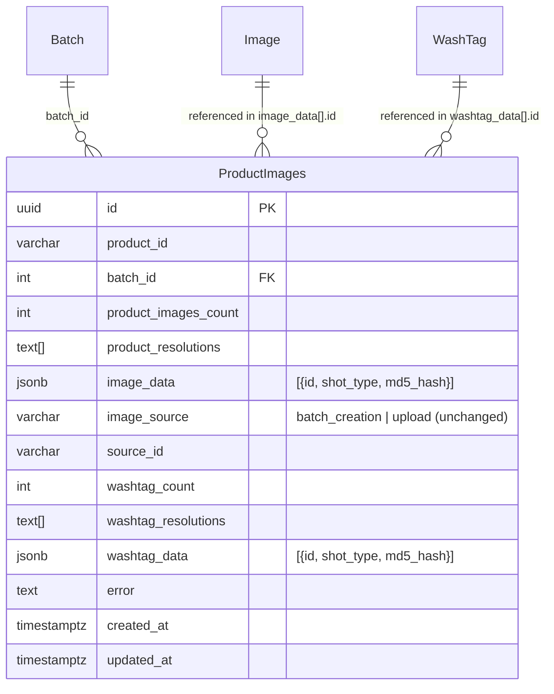

# Product Image Gallery with Reordering, Upload & Metadata

## Enhancement Summary

**Deepened on:** 2026-03-31
**Research agents used:** 12 (Architecture Strategist, Security Sentinel, Data Migration Expert, Data Integrity Guardian, Performance Oracle, Python Reviewer, Frontend Races Reviewer, Code Simplicity Reviewer, Best Practices Researcher, Framework Docs Researcher, Pattern Recognition Specialist, Deployment Verification Agent)

### Key Improvements from Research
1. **Migration safety:** 4-phase expand-contract migration replaces the original single-step approach
2. **DnD library:** Switch from deprecated `react-beautiful-dnd` to `dnd-kit` with `rectSortingStrategy` for grid support
3. **Batch save UX:** All changes (reorder, upload, delete) happen locally in UI state; single "Save" click persists to GCS + DB
4. **GCS performance:** Parallelize blob operations with `asyncio.gather` (reorder drops from ~8s to ~1.6s)
5. **Security hardening:** Product ID regex validation, Pillow re-encoding, decompression bomb guard, authz checks
6. **Concurrency:** Transaction-scoped advisory locks (`pg_try_advisory_xact_lock`) with deterministic SHA-256 hashing
7. **DB access pattern:** Use raw SQL (`execute_query_dict`) for Photography DB, not duplicated ORM models
8. **Optimistic concurrency:** Check `updated_at` on save to detect if another process modified the record

### Critical Issues Discovered
- `react-beautiful-dnd` is **archived** (April 2025) -- must use `dnd-kit` instead
- Dropping columns in same migration as adding them risks **irrecoverable data loss** -- must use expand-contract
- Photography API uses **no advisory locks** -- adding them to Listing Tool alone provides zero protection
- Without optimistic concurrency check (`updated_at`), concurrent batch pipeline writes can silently conflict with gallery saves
- Pillow `Image.open()` without `MAX_IMAGE_PIXELS` guard enables **decompression bomb DoS**
- `product_id` interpolated directly into GCS paths with **no validation** enables path traversal

---

## Overview

Build a product image gallery on the ManageProducts page (Listing Tool UI) that displays product images and washtags from the `lux_products` GCS bucket, supports drag-and-drop reordering, and allows uploading new images at specific positions. Enrich the `ProductImages` data model to store per-image metadata (`shot_type`, `md5_hash`) replacing the flat UUID arrays, and introduce `id="manual"` for user-uploaded images.

**Systems affected:**
1. **Photography DB** (`lux_photography`) -- data model migration (4-phase expand-contract)
2. **Photography API** (`/home/ubuntu/Luxemporium/PhotoManagementNew/API/`) -- update consumers of old columns + add advisory lock acquisition
3. **Listing Tool API** (`/home/ubuntu/Luxemporium/Listing Tool New/API/`) -- raw SQL connection to `lux_photography`, new GCS upload service, new endpoints
4. **Listing Tool UI** (`/home/ubuntu/Luxemporium/Listing Tool New/UI/`) -- new gallery component with `dnd-kit`

## Problem Statement / Motivation

Currently, the ManageProducts page shows only a single thumbnail per product (`buildProductImageUrl(parentId, 1_90.jpg)`). There is no way to:
- View all product images and washtags in one place
- Reorder images (which determines the hero image for marketplaces)
- Upload replacement or additional images manually
- See image metadata (shot type, source)

The `ProductImages` model stores `image_ids` and `washtag_ids` as flat text arrays with no metadata, making it impossible to track which images were manually uploaded vs batch-created, or what shot type each image represents.

## Proposed Solution

### Architecture

```
User Browser
    |
    v
Listing Tool UI (React/MUI + dnd-kit)
    |  sendRequest()
    v
Listing Tool API (FastAPI)
    |-- Raw SQL connection to lux_photography (execute_query_dict)
    |-- GCS upload service (gcloud-aio-storage + Pillow)
    v
GCS Bucket: lux_products
```

The **Listing Tool API** connects to the `lux_photography` database as a 4th named connection and uses **raw SQL** (`execute_query_dict`) for all `ProductImages` reads/writes. This follows the existing precedent set by `listing_options` and `product_db` connections, avoids ORM model duplication, and makes the cross-service coupling explicit and narrow.

### Research Insights: DB Access Pattern

**Why raw SQL instead of duplicated ORM models** (from Architecture Review):
- The Listing Tool already accesses `listing_options` and `product_db` via raw SQL -- duplicating the `ProductImages` Tortoise model would break this precedent
- Schema coupling: any Photography API migration that changes `ProductImages` would require coordinated changes to a second model copy
- Migration ownership: only the Photography API should run `aerich` migrations on `lux_photography`
- Raw SQL makes the coupling explicit -- you see exactly which columns are read/written

### Data Model Change -- Replace Old Columns

**Drop `image_ids` and `washtag_ids`** (flat text arrays) and replace with JSONB fields.

**Impact of dropping old columns** (files in Photography API needing updates):

| File | Lines | Change |
|------|-------|--------|
| `gcs_upload_processor.py` | 317-318, 466, 476 | Read/write `image_data` instead of `image_ids` |
| `gcs_product_uploader.py` | 123-182, 410-468 | Write `image_data`/`washtag_data_json` instead of old fields |
| `washtag_ai_processor.py` | 31-40 | Extract IDs from `washtag_data_json` instead of `washtag_ids` |

**New fields on `ProductImages`:**

```python
# Replace image_ids ArrayField with:
image_data = fields.JSONField(default=[], null=False)
# [
#   {"id": "image-uuid-1", "shot_type": "Front", "md5_hash": "a1b2c3..."},
#   {"id": "manual", "shot_type": null, "md5_hash": "d4e5f6..."},
#   {"id": "image-uuid-3", "shot_type": "Back", "md5_hash": "g7h8i9..."}
# ]

# Replace washtag_ids ArrayField with:
washtag_data = fields.JSONField(default=[], null=False)
# [
#   {"id": "washtag-uuid-1", "shot_type": "Care Label", "md5_hash": "x1y2z3..."},
#   {"id": "manual", "shot_type": null, "md5_hash": "m4n5o6..."}
# ]
```

- `id`: UUID from the `Image`/`WashTag` table, or `"manual"` for user-uploaded images
- `shot_type`: string from the Photography pipeline, or `null` for manual uploads
- `md5_hash`: hex digest of the original uploaded image bytes

### Research Insights: Data Model

**Naming consistency** (from Data Migration Expert): Use `image_data` and `washtag_data` (not `washtag_data_json`). Both are JSONB -- the column type communicates the format.

**Null handling** (from Data Migration Expert + Data Integrity Guardian): Use `default=[], null=False` (not `null=True`). A single "empty" state (`[]`) eliminates ambiguity in every consumer query. Add a CHECK constraint:
```sql
ALTER TABLE productimages ADD CONSTRAINT check_image_data_structure
CHECK (jsonb_typeof(image_data) = 'array');
```

**JSONB validation** (from Security Sentinel): Validate structure with Pydantic before writing:
```python
class ImageDataEntry(BaseModel):
    id: str = Field(..., pattern=r'^[a-f0-9\-]{36}$|^manual$')
    shot_type: str | None = Field(None, max_length=50)
    md5_hash: str | None = Field(None, pattern=r'^[a-f0-9]{32}$')
```

### GCS Path Conventions (Existing)

| Type | Path Pattern | Resolutions |
|------|-------------|-------------|
| Product image | `{product_id}/{index}_{resolution}.jpg` | 300, 600, 1500 |
| Washtag | `{product_id}/washtag_{index}.jpg` | single (min_side=1500) |

### Reorder Strategy

Reordering image A to position B requires renaming GCS blobs via copy + delete.

**Algorithm:** Parallelize with `asyncio.gather` for performance:
```python
# Phase 1: Copy target to temp (3 ops, parallel)
await asyncio.gather(*[storage.copy(bucket, src, bucket, f"_tmp_{uuid}/{res}") for res in resolutions])

# Phase 2: Shift all affected images in parallel
shift_tasks = []
for idx in affected_indices:
    for res in resolutions:
        shift_tasks.append(storage.copy(bucket, old_path, bucket, new_path))
await asyncio.gather(*shift_tasks)

# Phase 3: Place target at final position + delete originals (parallel)
await asyncio.gather(*[storage.copy(bucket, tmp, bucket, final) for res in resolutions])
await asyncio.gather(*[storage.delete(bucket, path) for path in all_old_paths + temp_paths])
```

**Performance** (from Performance Oracle): Parallel reorder of 5 images = ~4 rounds x 400ms = **1.6 seconds** (vs 8.1s sequential). Well within the 15-second target.

**Failure handling:** GCS operations first, DB write last. If DB write fails, GCS is in the new order but DB reflects old order -- log for reconciliation. Temp files serve as recovery point; a periodic cleanup sweep deletes `_tmp_*` blobs older than 1 hour.

**Concurrency:** Use `pg_try_advisory_xact_lock` (transaction-scoped, non-blocking) with deterministic SHA-256 hashing:
```python
import hashlib, struct

def product_lock_key(product_id: str) -> int:
    digest = hashlib.sha256(product_id.encode()).digest()
    return struct.unpack('>q', digest[:8])[0]

# Acquire within a transaction -- auto-releases on commit/rollback
async with conn.transaction():
    acquired = await conn.fetchval("SELECT pg_try_advisory_xact_lock($1)", lock_key)
    if not acquired:
        raise HTTPException(409, "Product images are being modified")
    # ... perform operation ...
```

**Both services must use the same lock.** The Photography API must also acquire `pg_try_advisory_xact_lock` before writing to `ProductImages`. Without this, the lock provides zero protection.

### Batch Save Workflow

All changes happen locally in UI state first. Only when the user clicks **"Save"** does the API persist everything at once.

**User flow:**
1. Gallery loads -- fetches latest `ProductImages` record, stores `updated_at` timestamp
2. User makes changes locally (all instant, no API calls):
   - Drag-and-drop to reorder images
   - Click "Upload" to add a new image (file stored in browser memory)
   - Click "Delete" to mark an image for removal
3. User clicks **"Save"**
4. UI sends entire new state to Listing Tool API (`POST /products/images/save`)
5. Listing Tool API:
   a. Finds latest `ProductImages` record for the product
   b. Checks `updated_at` matches what the UI loaded (optimistic concurrency)
   c. If `updated_at` changed: returns 409 Conflict ("Images were modified. Reload?")
   d. Acquires advisory lock
   e. For each new/moved image: re-encodes through Pillow, generates resolutions, uploads to GCS
   f. For deleted images: removes GCS blobs and shifts indices
   g. For reordered images: renames GCS blobs (copy + delete, parallelized)
   h. Updates `ProductImages.image_data` with the final state
   i. Returns success with updated image list
6. UI refreshes gallery from response

**Important:** `image_source` on the `ProductImages` record stays as-is (`batch_creation` or `upload`). The `"manual"` identifier lives only inside `image_data[].id` to distinguish per-image origin.

### Research Insights: Upload Security

**Decompression bomb guard** (from Security Sentinel + Best Practices):
```python
from PIL import Image, ImageOps
Image.MAX_IMAGE_PIXELS = 25_000_000  # ~5000x5000 max

# Re-encode EVERY upload -- strips embedded payloads
img = Image.open(io.BytesIO(file_bytes))
img = ImageOps.exif_transpose(img)
img = img.convert("RGB")  # Strips alpha, EXIF data, embedded content
```

**Product ID validation** (from Security Sentinel -- CRITICAL):
```python
import re
PRODUCT_ID_PATTERN = re.compile(r'^[A-Za-z0-9][A-Za-z0-9\-_]{0,99}$')

def validate_product_id(product_id: str) -> str:
    if not PRODUCT_ID_PATTERN.match(product_id) or '..' in product_id:
        raise ValueError(f"Invalid product_id format")
    return product_id.strip('/')
```

**Stream MD5 for large files** (from Python Reviewer):
```python
md5 = hashlib.md5()
while chunk := await file.read(8192):
    md5.update(chunk)
await file.seek(0)
```

### Cache Busting

After any reorder/upload/delete, append `?v={timestamp}` to image URLs in the UI. Use the **same** timestamp for all images in a single gallery load to maximize browser connection reuse. Only update after a mutation.

**Research insight** (from Frontend Races Reviewer): Add a 1.5s delay before re-fetching after mutations to allow GCS propagation:
```js
await new Promise(resolve => setTimeout(resolve, 1500));
```

### Optimistic Concurrency

On gallery load, store the record's `updated_at` timestamp. On save, the API checks if `updated_at` still matches. If another process modified the record between load and save, the API returns 409 and the UI shows a dialog: "Product images were updated by another user." Clicking "Refresh" or closing the dialog refreshes the gallery with the latest data. The user can then re-apply their changes if needed.

## Implementation Phases

### Phase 1: Data Model Migration (4-Step Expand-Contract)

**Goal:** Safely add `image_data`/`washtag_data` JSONB fields, backfill, and eventually drop old columns.

**Step 1.1 -- Add new columns (non-destructive):**
```sql
ALTER TABLE productimages
  ADD COLUMN image_data JSONB NOT NULL DEFAULT '[]'::jsonb,
  ADD COLUMN washtag_data JSONB NOT NULL DEFAULT '[]'::jsonb;

ALTER TABLE productimages ADD CONSTRAINT check_image_data_array
  CHECK (jsonb_typeof(image_data) = 'array');
ALTER TABLE productimages ADD CONSTRAINT check_washtag_data_array
  CHECK (jsonb_typeof(washtag_data) = 'array');
```

- [ ] Generate aerich migration: `aerich migrate --name add_image_washtag_data_jsonb`
- [ ] Deploy migration. Verify columns exist.

**Step 1.2 -- Backfill new columns from old:**

```python
# Batched, idempotent backfill script
BATCH_SIZE = 500

async def backfill():
    records = await ProductImages.filter(image_data=[]).limit(BATCH_SIZE).all()
    for record in records:
        image_entries = []
        for uuid_str in (record.image_ids or []):
            image = await Image.filter(id=uuid_str).first()
            image_entries.append({
                "id": str(uuid_str),
                "shot_type": image.shot_type if image else None,
                "md5_hash": None,  # not available retroactively
            })
        record.image_data = image_entries
        # Similar for washtag_ids -> washtag_data
        await record.save(update_fields=["image_data", "washtag_data"])
```

- [ ] Run backfill script
- [ ] Verify with SQL:
  ```sql
  -- Must return 0:
  SELECT COUNT(*) FROM productimages
  WHERE array_length(image_ids, 1) > 0
    AND (image_data = '[]'::jsonb);
  ```

**Step 1.3 -- Deploy dual-read/dual-write code:**
- [ ] Update Photography API to write BOTH old and new fields
- [ ] Update Photography API to read from new fields with fallback to old:
  ```python
  def get_image_ids(record):
      if record.image_data:
          return [entry["id"] for entry in record.image_data]
      return list(record.image_ids or [])
  ```
- [ ] Monitor for 24-48 hours

**Step 1.4 -- Drop old columns (after verification):**
- [ ] Create backup table first:
  ```sql
  CREATE TABLE productimages_legacy_backup AS
  SELECT id, image_ids, washtag_ids FROM productimages;
  ```
- [ ] Run all 5 verification queries (see deployment checklist)
- [ ] Deploy code that removes old column references
- [ ] Drop columns: `ALTER TABLE productimages DROP COLUMN image_ids, DROP COLUMN washtag_ids;`
- [ ] Clean up backup table after 30 days

**Success criteria:** All existing `ProductImages` records have populated `image_data` and `washtag_data` fields. Old columns are dropped.

### Phase 2: Update Photography API Consumers + Add Advisory Locks

**Goal:** Update files that read/write old columns. Add advisory lock acquisition to Photography API writes.

**Files to modify:**
- `/home/ubuntu/Luxemporium/PhotoManagementNew/API/utils/gcs_product_uploader.py`
- `/home/ubuntu/Luxemporium/PhotoManagementNew/API/utils/gcs_upload_processor.py`
- `/home/ubuntu/Luxemporium/PhotoManagementNew/API/utils/washtag_ai_processor.py`

**Tasks:**

- [ ] `gcs_product_uploader.py` -- `process_single_product_upload()`:
  - Build `image_data` list: `[{"id": image_id, "shot_type": img.shot_type, "md5_hash": hashlib.md5(image_bytes).hexdigest()}]`
  - Acquire `pg_try_advisory_xact_lock` before writing ProductImages
- [ ] `gcs_product_uploader.py` -- `process_single_product_washtags()`:
  - Build `washtag_data` list similarly
  - Acquire advisory lock before writing
- [ ] `gcs_upload_processor.py`:
  - Read `image_data` (extract IDs with `[item["id"] for item in (record.image_data or [])]`)
  - Build new `image_data` with structured entries for diffing
  - Acquire advisory lock before writing
- [ ] `washtag_ai_processor.py`:
  - Change `washtag_ids = product_images.washtag_ids or []` to `washtag_ids = [item["id"] for item in (product_images.washtag_data or [])]`
- [ ] Add shared advisory lock utility:
  ```python
  # utils/advisory_lock.py
  import hashlib, struct
  def product_lock_key(product_id: str) -> int:
      digest = hashlib.sha256(product_id.encode()).digest()
      return struct.unpack('>q', digest[:8])[0]
  ```

**Success criteria:** Photography API uses new fields, acquires advisory locks on every ProductImages write.

### Phase 3: Listing Tool API -- DB Connection, GCS Service & Endpoints

**Goal:** Add `lux_photography` DB connection (raw SQL), GCS image management service, and REST endpoints.

**Files to modify:**
- `/home/ubuntu/Luxemporium/Listing Tool New/API/config.py` (add photography DB connection)
- `/home/ubuntu/Luxemporium/Listing Tool New/API/app.py` (register connection, service lifecycle)

**Files to create:**
- `/home/ubuntu/Luxemporium/Listing Tool New/API/services/image_service.py` -- Singleton service with GCS operations
- `/home/ubuntu/Luxemporium/Listing Tool New/API/utils/image_processor.py` -- Pillow resize logic
- `/home/ubuntu/Luxemporium/Listing Tool New/API/routes/image_routes.py` -- Endpoints (or add to `product_routes.py`)
- `/home/ubuntu/Luxemporium/Listing Tool New/API/models/image_api_models.py` -- Pydantic schemas

**Tasks:**

- [ ] Add `lux_photography` connection to Tortoise config (raw SQL only):
  ```python
  PHOTO_DB_CONFIG = config.get("photography_database", {})
  PHOTO_DB_URL = f"postgres://{PHOTO_DB_CONFIG['db_user']}:..."
  # Add to connections dict, no model registration needed for raw SQL
  ```
- [ ] Create `image_service.py` as singleton (Pattern B -- matching `SellerCloudService`):
  ```python
  class ImageService:
      _storage: Storage | None = None

      async def initialize(self) -> None:
          self._storage = Storage(service_file="service-account-2.json")

      async def close(self) -> None:
          if self._storage:
              await self._storage.close()

      async def get_product_images(self, product_id: str) -> dict[str, Any]: ...
      async def reorder_images(self, product_id: str, ...) -> dict[str, Any]: ...
      async def upload_image(self, product_id: str, ...) -> dict[str, Any]: ...
      async def delete_image(self, product_id: str, ...) -> dict[str, Any]: ...

  image_service = ImageService()  # Module-level singleton
  ```
- [ ] Wire `image_service.initialize()` / `.close()` in `app.py` startup/shutdown
- [ ] Port `process_image_resolutions()` from Photography API's `image_processor.py`:
  - Use `LANCZOS` resampling, `reducing_gap=2.0`
  - Call `ImageOps.exif_transpose()` first
  - Set `Image.MAX_IMAGE_PIXELS = 25_000_000`
  - Convert to RGB before saving
  - Use `asyncio.to_thread()` with semaphore (max 3 concurrent)
- [ ] Create Pydantic models with strict validation:
  ```python
  class ImageType(StrEnum):
      IMAGE = "image"
      WASHTAG = "washtag"

  class ImageUploadMode(StrEnum):
      INSERT = "insert"
      REPLACE = "replace"

  class ImageReorderRequest(BaseModel):
      product_id: str = Field(..., pattern=r'^[A-Za-z0-9][A-Za-z0-9\-_]{0,99}$')
      from_index: int = Field(..., ge=1, le=8)
      to_index: int = Field(..., ge=1, le=8)
      image_type: ImageType = ImageType.IMAGE
  ```
- [ ] Implement endpoints (in `image_routes.py` or `product_routes.py`):
  - `GET /products/images?product_id={id}` -- returns image metadata + URLs + `updated_at`
  - `POST /products/images/save` -- multipart: receives new ordering, new files, deleted indices, and `updated_at` for optimistic concurrency check. Handles all GCS operations in one request.
- [ ] Add `product_id` validation on every endpoint
- [ ] Add `gcloud-aio-storage` and `Pillow` to `requirements.txt`

**Endpoint details:**

```python
# Save endpoint -- multipart for file uploads + JSON for ordering/deletes
@router.post("/save")
async def save_product_images(
    product_id: str = Form(...),
    updated_at: str = Form(...),  # ISO timestamp from gallery load (optimistic concurrency)
    new_order: str = Form(...),   # JSON string: ordered list of image IDs
    deleted_indices: str = Form("[]"),  # JSON string: list of indices to delete
    image_type: str = Form("image"),
    files: list[UploadFile] = File(default=[]),  # New images to upload
    file_positions: str = Form("[]"),  # JSON string: index positions for each new file
) -> ImageSaveResponse:
    validate_product_id(product_id)
    # 1. Check updated_at matches latest record (409 if changed)
    # 2. Acquire advisory lock
    # 3. Process deletes -> reorders -> uploads (all GCS ops parallelized)
    # 4. Update image_data in single DB write
```

**GET response includes `updated_at` for optimistic concurrency:**
```json
{
  "product_id": "ABC-123",
  "updated_at": "2026-03-31T12:00:00Z",
  "images": [...],
  "washtags": [...],
  "image_count": 5,
  "washtag_count": 2
}
```

**Success criteria:** All endpoints work. Reorder parallelizes GCS ops. Upload re-encodes through Pillow. Advisory locks coordinate with Photography API.

### Phase 4: Listing Tool UI -- Gallery Component

**Goal:** Build the product image gallery with `dnd-kit` drag-and-drop grid reordering and upload.

**Files to create:**
- `/home/ubuntu/Luxemporium/Listing Tool New/UI/src/components/ProductImageGallery.js`

**Files to modify:**
- `/home/ubuntu/Luxemporium/Listing Tool New/UI/src/pages/ManageProducts.js` (integrate gallery)
- `/home/ubuntu/Luxemporium/Listing Tool New/UI/src/utils/productImages.js` (extend URL builder)
- `/home/ubuntu/Luxemporium/Listing Tool New/UI/package.json` (add `@dnd-kit/core`, `@dnd-kit/sortable`, `@dnd-kit/utilities`)

#### Why dnd-kit, not react-beautiful-dnd

`react-beautiful-dnd` was **archived April 2025** and does not support React 18 StrictMode or grid layouts. `@hello-pangea/dnd` (the fork) also lacks grid support. `dnd-kit` with `rectSortingStrategy` handles multi-row grids correctly.

```bash
npm uninstall react-beautiful-dnd
npm install @dnd-kit/core @dnd-kit/sortable @dnd-kit/utilities
```

#### Component Design: `ProductImageGallery`

```
+---------------------------------------------------------------+
| Product Images                                    [Upload +]  |
+---------------------------------------------------------------+
| +--------+  +--------+  +--------+  +--------+  +--------+   |
| |   1    |  |   2    |  |   3    |  |   4    |  |   5    |   |
| | [img]  |  | [img]  |  | [img]  |  | [img]  |  | [img]  |   |
| | Front  |  | Back   |  | Side   |  | Detail |  | Manual |   |
| |[x][^v] |  |[x][^v] |  |[x][^v] |  |[x][^v] |  |[x][^v] |   |
| +--------+  +--------+  +--------+  +--------+  +--------+   |
|                                                               |
| Washtags                                          [Upload +]  |
+---------------------------------------------------------------+
| +--------+  +--------+                                        |
| |   1    |  |   2    |                                        |
| | [img]  |  | [img]  |                                        |
| +--------+  +--------+                                        |
+---------------------------------------------------------------+
```

#### Simplified State Management (Batch Save Approach)

Since all changes are local until "Save," most race conditions are eliminated:

- **No double-drag race**: Reorders just update local array state -- no API calls to conflict
- **No upload-during-reorder**: Uploads add to local state, not GCS -- no server-side conflicts
- **Rapid product switching**: Use generation counter on fetch to discard stale responses:

```js
const fetchGenerationRef = useRef(0);

useEffect(() => {
    const gen = ++fetchGenerationRef.current;
    setHasChanges(false);
    fetchProductImages(productId).then(response => {
        if (gen !== fetchGenerationRef.current) return; // Stale, discard
        setImages(response.images);
        setUpdatedAt(response.record_updated_at);  // For optimistic concurrency
    });
}, [productId]);
```

**Save button state**: Track `hasChanges` to enable/disable the Save button. Show confirmation on navigation away if unsaved changes exist.

**Memoize gallery** with `React.memo` -- ManageProducts has 58 useState hooks; memoization prevents unnecessary re-renders:
```js
export default React.memo(ProductImageGallery);
```

#### UX Details

- **Grid layout:** CSS Grid with `dnd-kit` `rectSortingStrategy` + `DragOverlay` for floating preview
- **Batch save:** All changes are local until user clicks "Save" button
- **Save button:** Disabled when no changes; shows "Saving..." with spinner during API call
- **Unsaved changes guard:** Confirm dialog on navigation away if `hasChanges` is true
- **Loading state:** Show "Saving..." overlay during the save API call
- **Empty state:** "No images found" with prominent upload button
- **Error state:** Toast notification via `notistack` on failure; 409 Conflict prompts reload
- **Cache busting:** Append `?v={Date.now()}` to all image URLs after successful save
- **Image preview:** Click image to view full size (1500px) in a lightbox/modal
- **Max limits:** 8 product images, 3 washtags (disable upload button when full)
- **Local upload preview:** Show uploaded images immediately using `URL.createObjectURL()` before save

**Tasks:**

- [ ] Install `@dnd-kit/core`, `@dnd-kit/sortable`, `@dnd-kit/utilities`
- [ ] Create `ProductImageGallery.js` with:
  - `DndContext` + `SortableContext` with `rectSortingStrategy` for grid DnD
  - `DragOverlay` for visual polish during drag
  - `PointerSensor` with `activationConstraint: { distance: 8 }` to prevent accidental drags
  - `draggable={false}` on `` elements (prevents native browser image drag)
  - Operation queue for serialized mutations
  - Generation counter for stale fetch prevention
  - Record ID pinning for stable writes
  - Image upload input (hidden `<input type="file" accept="image/*">` triggered by button)
  - Replace/delete actions per image card
  - Separate sections for images and washtags
- [ ] Extend `productImages.js` with helpers:
  ```js
  export const buildProductImageUrlAtIndex = (productId, index, resolution = 1500) =>
    `https://storage.googleapis.com/lux_products/${productId}/${index}_${resolution}.jpg`;

  export const buildWashtagUrl = (productId, index) =>
    `https://storage.googleapis.com/lux_products/${productId}/washtag_${index}.jpg`;
  ```
- [ ] Integrate gallery into `ManageProducts.js`:
  ```jsx
  <ProductImageGallery productId={selectedProduct.parentId} />
  ```
- [ ] Add API call functions using `sendRequest`

**Success criteria:** Gallery loads all images, drag-and-drop reorders in grid layout, upload adds new image with all resolutions, delete removes image and shifts indices. No race conditions under rapid interaction.

### Phase 5: Polish & Edge Cases

**Tasks:**

- [ ] Handle products with no images (empty state UI)
- [ ] Handle products with no `ProductImages` record (show "No images" state)
- [ ] Add max image limit validation (8 product images, 3 washtags)
- [ ] Add file type validation in UI (`accept="image/jpeg,image/png,image/webp"`)
- [ ] Add file size validation in UI (max 10MB warning before upload)
- [ ] Add loading overlay during reorder/upload/delete operations
- [ ] Test concurrent editing (advisory lock returns 409)
- [ ] Verify `spo_service.py` and `ai_service.py` work correctly after reorder
- [ ] Test with products that have gaps in image indices
- [ ] Add audit logging for image operations (user ID + operation + product_id)
- [ ] Clean up `sellercloud_service.get_product_images()` to delegate to `image_service` where appropriate

## System-Wide Impact

### Interaction Graph

1. **Image reorder** triggers: Advisory lock -> GCS blob copy/delete (parallelized) -> `ProductImages.image_data` DB update (raw SQL) -> cache-busted URL reload in UI
2. **Image upload** triggers: Pillow re-encode + resize (3 variants in thread pool) -> GCS upload (3 blobs, parallel) -> `ProductImages` record update (raw SQL) -> UI refresh
3. **Photography API consumers** (updated in Phase 2):
   - `gcs_upload_processor.py` reads `image_data` (extracts IDs for diffing)
   - `gcs_product_uploader.py` writes `image_data`/`washtag_data`
   - `washtag_ai_processor.py` reads `washtag_data` (extracts IDs for AI processing)
   - All acquire advisory lock before writing
4. **Unaffected code** (uses GCS URLs directly, not DB fields):
   - `sellercloud_service.py` probes GCS via HEAD requests
   - `ai_service.py` fetches images by URL
   - `spo_service.py` uses index-based URLs

### Error Propagation

- GCS copy failure -> reorder aborted, UI shows error toast, refetch from server
- GCS delete failure (after copy) -> orphaned files, logged, cleanup sweep handles
- DB connection failure -> API returns 500, UI shows error toast
- Advisory lock contention -> API returns 409, UI shows "Product being modified" toast
- File too large -> UI validates before upload, server rejects with 413
- Invalid file type -> Pillow re-encode catches non-images, raises 400
- Decompression bomb -> `MAX_IMAGE_PIXELS` guard raises, returns 400

### State Lifecycle Risks

- **Partial reorder failure:** Temp files in GCS may be orphaned. Mitigation: cleanup sweep for `_tmp_*` blobs older than 1 hour.
- **Two systems writing same table:** Both Photography API (batch pipeline) and Listing Tool API (manual gallery) write to `ProductImages`. Both acquire `pg_try_advisory_xact_lock` with identical hash derivation. On save, the API checks `updated_at` matches the value from gallery load -- if Photography pipeline modified the record, save returns 409 and the user reloads.
- **GCS/DB desynchronization:** GCS operations are not transactional. Adopt "GCS first, DB last" pattern. If DB write fails, GCS is in new state but DB reflects old -- logged for reconciliation.

## Acceptance Criteria

### Functional Requirements

- [ ] Gallery displays all product images with correct ordering and thumbnails
- [ ] Gallery displays washtags in a separate section
- [ ] Drag-and-drop reorders images in a grid layout and persists to GCS + database
- [ ] User can upload a new image at a specific position (insert mode)
- [ ] User can replace an existing image with a new upload
- [ ] User can delete an image (shifts subsequent indices)
- [ ] Manual uploads are stored with `id="manual"` in `image_data`
- [ ] MD5 hash is computed and stored for all new uploads
- [ ] `ProductImages` model has `image_data` and `washtag_data` JSONB fields replacing old array fields
- [ ] Photography API consumers work with new fields and acquire advisory locks
- [ ] All uploads are re-encoded through Pillow (security)
- [ ] Product ID is validated with regex on every endpoint

### Non-Functional Requirements

- [ ] Image upload processes within 10 seconds for a 10MB file
- [ ] Reorder completes within 5 seconds (parallelized GCS operations)
- [ ] Gallery loads within 500ms (single DB query, no GCS HEAD probes)
- [ ] No data loss during reorder -- temp files prevent overwriting
- [ ] Concurrent modification attempts return 409 (advisory lock)
- [ ] 4-phase migration with verification queries at each step

## Dependencies & Prerequisites

- **GCS service account** (`service-account-2.json`) -- verify it has only `roles/storage.objectAdmin` on `lux_products`
- **`lux_photography` DB credentials** -- create dedicated least-privilege user (`SELECT`, `UPDATE` on `productimages` only)
- **Pillow** -- add to Listing Tool API `requirements.txt`
- **`gcloud-aio-storage`** -- add to Listing Tool API `requirements.txt`
- **`@dnd-kit/core`**, **`@dnd-kit/sortable`**, **`@dnd-kit/utilities`** -- add to UI `package.json`
- **Clean up 167 duplicate approved image groups** before migration (see known issues)

## Risk Analysis & Mitigation

| Risk | Impact | Likelihood | Mitigation |
|------|--------|------------|------------|
| GCS reorder partially fails | Orphaned temp files | Medium | Cleanup sweep, "GCS first, DB last" pattern |
| Concurrent edits corrupt data | Wrong image ordering | Low | Advisory locks (both services), optimistic locking via `updated_at` |
| Photography pipeline overwrites manual changes | User work lost | Medium | Gallery pins to record ID, detects new records via `updated_at`, prompts reload |
| Migration breaks existing consumers | Pipeline failures | Low | 4-phase expand-contract with 24-48h monitoring between phases |
| Decompression bomb DoS | Server OOM | Low | `MAX_IMAGE_PIXELS` guard + file size limit |
| Path traversal via product_id | Data corruption | Medium | Regex validation on every endpoint |
| Browser cache shows stale images | Confusing UX | High | Cache-busting query params |

## Deployment Order

See detailed checklist: `docs/plans/2026-03-31-deployment-checklist-product-image-gallery.md`

**Summary (5 steps, all reversible until step 5):**
1. Add new JSONB columns (non-destructive DDL)
2. Backfill from old columns (old columns untouched)
3. Deploy Photography API (dual-read, writes new fields, acquires advisory locks)
4. Deploy Listing Tool API + UI (new columns exist, Photography API ready)
5. Drop old columns (only after 24-48h verification)

## ERD: Updated ProductImages Model



## Sources & References

### Internal References

- ProductImages model: `/home/ubuntu/Luxemporium/PhotoManagementNew/API/models/db_models.py:363-411`
- GCS product uploader: `/home/ubuntu/Luxemporium/PhotoManagementNew/API/utils/gcs_product_uploader.py`
- GCS upload processor: `/home/ubuntu/Luxemporium/PhotoManagementNew/API/utils/gcs_upload_processor.py`
- Washtag AI processor: `/home/ubuntu/Luxemporium/PhotoManagementNew/API/utils/washtag_ai_processor.py`
- Image processor (resolutions): `/home/ubuntu/Luxemporium/PhotoManagementNew/API/utils/image_processor.py`
- ManageProducts page: `/home/ubuntu/Luxemporium/Listing Tool New/UI/src/pages/ManageProducts.js`
- Product routes: `/home/ubuntu/Luxemporium/Listing Tool New/API/routes/product_routes.py`
- Listing Tool config: `/home/ubuntu/Luxemporium/Listing Tool New/API/config.py`
- SellerCloud image probing: `/home/ubuntu/Luxemporium/Listing Tool New/API/services/sellercloud_service.py:388-499`
- Product image URL builder: `/home/ubuntu/Luxemporium/Listing Tool New/UI/src/utils/productImages.js`
- LazyImage component: `/home/ubuntu/Luxemporium/Listing Tool New/UI/src/components/LazyImage.js`
- Existing DnD usage: `/home/ubuntu/Luxemporium/Listing Tool New/UI/src/pages/ManageTemplates.js`
- GCS config: `/home/ubuntu/Luxemporium/PhotoManagementNew/API/config.toml`
- Deployment checklist: `/home/ubuntu/Luxemporium/Listing Tool New/docs/plans/2026-03-31-deployment-checklist-product-image-gallery.md`

### External References

- dnd-kit Sortable docs: https://docs.dndkit.com/presets/sortable
- gcloud-aio-storage API: https://talkiq.github.io/gcloud-aio/autoapi/storage/index.html
- Pillow Image docs: https://pillow.readthedocs.io/en/stable/reference/Image.html
- PostgreSQL Advisory Locks: https://www.postgresql.org/docs/current/explicit-locking.html
- GCS Cache-Control: https://cloud.google.com/storage/docs/caching

### Known Issues

- Duplicate approved image records bug: `/home/ubuntu/Luxemporium/PhotoManagementNew/docs/duplicate_approved_images_bug.md` -- clean up 167 affected products before migration
- Missing `unique_together` constraint on production DB for Image model
